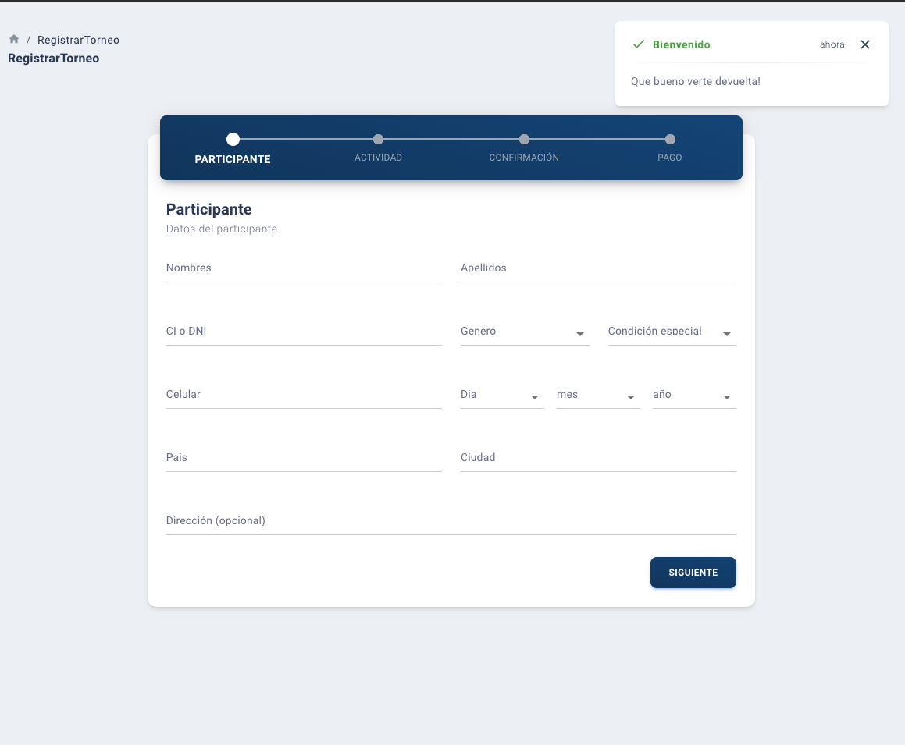

# [Makarios App - Nextjs Material React](https://makarios.club) [](https://twitter.com/intent/tweet?url=https%3A%2F%2Fcreativetimofficial.github.io%2Fnextjs-material-dashboard&text=NextJS%20Material%20Dashboard%20-%20Free%20NextJS%20Admin%20Template&original_referer=https%3A%2F%2Fdemos.creative-tim.com%2Fnextjs-material-dashboard%2F%3F_ga%3D2.10428917.198078103.1532329372-1803433978.1528781151&via=creativetim&hashtags=react%2Cmaterial-ui)

  



NextJS Material Dashboard is a free Material-UI, NextJS and React Admin with a fresh, new design inspired by Google's Material Design. We are very excited to introduce our take on the material concepts through an easy to use and beautiful set of components. NextJS Material Dashboard was built over the popular Material-UI, NextJS and React frameworks.


## Table of Contents

- [Versions](#versions)
- [Demo](#demo)
- [Quick Start](#quick-start)
- [Documentation](#documentation)
- [File Structure](#file-structure)


## Versions

[](https://www.creative-tim.com/product/nextjs-material-dashboard)
[](https://www.creative-tim.com/product/material-dashboard-react-nodejs)
[](https://www.creative-tim.com/product/material-dashboard-react)


## Quick start

Quick start options:

- Clone the repo: `git clone https://github.com/israel2x/makarios.git`.
- `cd makarios`
- `npm i install`
- `npm run dev`


## Documentation

The documentation for the Material Dashboard React is hosted at our [website](https://www.creative-tim.com/learning-lab/nextjs/overview/material-dashboard).

## File Structure

Within the download you'll find the following directories and files:

```
nextjs-material-dashboard
.
├── CHANGELOG.md
├── ISSUE_TEMPLATE.md
├── LICENSE.md
├── README.md
├── assets
│   ├── css
│   │   └── nextjs-material-dashboard.css
│   ├── github
│   │   ├── md-react.gif
│   │   └── react.svg
│   ├── img
│   │   └── faces
│   └── jss
│       ├── nextjs-material-dashboard
│       │   ├── cardImagesStyles.js
│       │   ├── checkboxAdnRadioStyle.js
│       │   ├── components
│       │   │   ├── buttonStyle.js
│       │   │   ├── cardAvatarStyle.js
│       │   │   ├── cardBodyStyle.js
│       │   │   ├── cardFooterStyle.js
│       │   │   ├── cardHeaderStyle.js
│       │   │   ├── cardIconStyle.js
│       │   │   ├── cardStyle.js
│       │   │   ├── customInputStyle.js
│       │   │   ├── customTabsStyle.js
│       │   │   ├── footerStyle.js
│       │   │   ├── headerLinksStyle.js
│       │   │   ├── headerStyle.js
│       │   │   ├── rtlHeaderLinksStyle.js
│       │   │   ├── sidebarStyle.js
│       │   │   ├── snackbarContentStyle.js
│       │   │   ├── tableStyle.js
│       │   │   ├── tasksStyle.js
│       │   │   └── typographyStyle.js
│       │   ├── dropdownStyle.js
│       │   ├── layouts
│       │   │   ├── adminStyle.js
│       │   │   └── rtlStyle.js
│       │   ├── tooltipStyle.js
│       │   └── views
│       │       ├── dashboardStyle.js
│       │       ├── iconsStyle.js
│       │       └── rtlStyle.js
│       └── nextjs-material-dashboard.js
├── components
│   ├── Card
│   │   ├── Card.js
│   │   ├── CardAvatar.js
│   │   ├── CardBody.js
│   │   ├── CardFooter.js
│   │   ├── CardHeader.js
│   │   └── CardIcon.js
│   ├── CustomButtons
│   │   └── Button.js
│   ├── CustomInput
│   │   └── CustomInput.js
│   ├── CustomTabs
│   │   └── CustomTabs.js
│   ├── FixedPlugin
│   │   └── FixedPlugin.js
│   ├── Footer
│   │   └── Footer.js
│   ├── Grid
│   │   ├── GridContainer.js
│   │   └── GridItem.js
│   ├── Navbars
│   │   ├── AdminNavbarLinks.js
│   │   ├── Navbar.js
│   │   └── RTLNavbarLinks.js
│   ├── PageChange
│   │   └── PageChange.js
│   ├── Sidebar
│   │   └── Sidebar.js
│   ├── Snackbar
│   │   ├── Snackbar.js
│   │   └── SnackbarContent.js
│   ├── Table
│   │   └── Table.js
│   ├── Tasks
│   │   └── Tasks.js
│   └── Typography
│       ├── Danger.js
│       ├── Info.js
│       ├── Muted.js
│       ├── Primary.js
│       ├── Quote.js
│       ├── Success.js
│       └── Warning.js
├── documentation
│   ├── assets
│   │   ├── css
│   │   │   ├── bootstrap.min.css
│   │   │   ├── demo-documentation.css
│   │   │   └── material-dashboard.css
│   │   ├── img
│   │   │   └── faces
│   │   └── js
│   │       ├── bootstrap.min.js
│   │       └── jquery-3.2.1.min.js
│   └── tutorial-components.html
├── layouts
│   ├── Admin.js
│   └── RTL.js
├── next.config.js
├── package.json
├── pages
│   ├── _app.js
│   ├── _document.js
│   ├── _error.js
│   ├── admin
│   │   ├── dashboard.js
│   │   ├── icons.js
│   │   ├── maps.js
│   │   ├── notifications.js
│   │   ├── table-list.js
│   │   ├── typography.js
│   │   ├── upgrade-to-pro.js
│   │   └── user-profile.js
│   ├── index.js
│   └── rtl
│       └── rtl-page.js
├── routes.js
└── variables
    ├── charts.js
    └── general.js
```

## Browser Support

At present, we officially aim to support the last two versions of the following browsers:

    

## Resources

- Demo: https://demos.creative-tim.com/nextjs-material-dashboard
- Download Page: https://www.creative-tim.com/product/nextjs-material-dashboard
- Documentation: https://www.creative-tim.com/learning-lab/nextjs/overview/material-dashboard
- License Agreement: https://www.creative-tim.com/license
- Support: https://www.creative-tim.com/contact-us
- Issues: [Github Issues Page](https://github.com/creativetimofficial/nextjs-material-dashboard/issues)
- [Nepcha Analytics](https://nepcha.com?ref=readme) - Analytics tool for your website

### Kit Versions

[](https://www.creative-tim.com/product/nextjs-material-kit)

[](https://www.creative-tim.com/product/material-kit-ghots)

[](https://www.creative-tim.com/product/material-kit-react)

## Reporting Issues

We use GitHub Issues as the official bug tracker for the Material Dashboard React. Here are some advices for our users that want to report an issue:

1. Make sure that you are using the latest version of the Material Dashboard React. Check the CHANGELOG from your dashboard on our [website](https://www.creative-tim.com/).
2. Providing us reproducible steps for the issue will shorten the time it takes for it to be fixed.
3. Some issues may be browser specific, so specifying in what browser you encountered the issue might help.

## Technical Support or Questions

If you have questions or need help integrating the product please [contact us](https://www.creative-tim.com/contact-us) instead of opening an issue.

## Licensing

- Copyright 2024 Creative Tim (https://www.creative-tim.com)
- Licensed under MIT (https://github.com/creativetimofficial/nextjs-material-dashboard/blob/master/LICENSE.md)

## Useful Links

More products from Creative Tim: <https://www.creative-tim.com/products>

Tutorials: <https://www.youtube.com/channel/UCVyTG4sCw-rOvB9oHkzZD1w>


